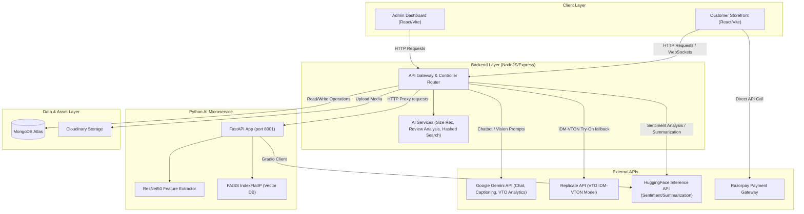

# AICart - AI Powered E-Commerce Application

AICart is a modern, AI-powered e-commerce platform built with the MERN stack (MongoDB, Express, React, Node.js). It includes an admin panel, user authentication, and a customer-facing storefront.

## Key Features

### Advanced Storefront

- **Modern UI/UX**: Responsive design with product filtering, search, and a premium product detail page.
- **Voice Assistant**: Hands-free navigation and product search powered by speech recognition.
- **AI Chatbot**: Intelligent assistant powered by Google Gemini.
  - **Global Context**: Answers general queries (return policy, contact info).
  - **Product Context**: Product-specific insights while viewing a product.
  - **Smart Caching**: Database caching for instant responses to common queries.

### AI Shopping Features

- **AI Virtual Try-On (VTO)**: Upload a photo of yourself and a garment to generate high-quality photos of yourself wearing the garment.
  - **FastAPI Microservice**: Handles complex generative model processing.
  - **Model Integration**: Powered by models like Gemini, Replicate, and Imagen (with fallbacks such as Flux Schnell, SDXL, and SDXL-Turbo for robust performance).
  - **Storage**: Optimized image storage on Cloudinary.
- **AI Visual Search**: Upload an image and find visually similar products (captioning + embeddings).
- **AI Size Finder**: KNN-based size recommendation using height/weight/body type and available sizes.
- **AI Review Insights (Sentiment + Fake Review Detection)**:
  - Positive/Negative/Neutral sentiment classification (HuggingFace by default, local fallback).
  - Suspicious/fake review heuristics (duplicate similarity + patterns like incentives / repetition).
  - Pros/cons extraction from mixed statements (e.g. "Battery life is poor but camera is excellent").
  - Optional short review summary (HuggingFace summarization model, best-effort).

### Secure & Scalable Backend

- **Authentication**: Firebase (Google Login) + JWT (Email/Password flow where applicable).
- **Database**: MongoDB Atlas.
- **Payments**: Razorpay integration.
- **Image Intelligence**: Cloudinary for optimized image storage and delivery.

### Comprehensive Admin Panel

- **Dashboard**: Statistics, sales charts, and order tracking.
- **Product Management**: CRUD with image uploads.
- **Order Management**: Track and update order statuses.

## Project Structure

```text
AICart/
|-- admin/                # Admin Dashboard (Vite + React)
|   `-- src/
|       |-- component/
|       |-- context/
|       |-- pages/
|       `-- App.jsx
|-- backend/              # Node.js/Express API Server
|   |-- config/
|   |-- controller/
|   |-- middleware/
|   |-- model/            # includes Review model
|   |-- routes/           # includes /api/ai and /api/review
|   `-- index.js
`-- frontend/             # Customer-Facing Application (Vite + React)
    `-- src/
        |-- component/
        |-- context/
        |-- pages/
        `-- App.jsx
```

## Getting Started

### Prerequisites

- Node.js (v18+ recommended)
- MongoDB account (for database)
- Cloudinary account (for image storage)
- Razorpay account (for payments)
- Hugging Face token (optional: sentiment + summarization)
- Google Gemini API key (optional: chatbot + visual search captioning)

### Installation

1. **Clone the repository:**

   ```bash
   git clone <repository-url>
   cd AICart
   ```

2. **Install dependencies:**
   - **Backend**
     ```bash
     cd backend
     npm install
     ```
   - **Frontend**
     ```bash
     cd ../frontend
     npm install
     ```
   - **Admin**
     ```bash
     cd ../admin
     npm install
     ```

### Configuration (.env)

**Backend (`backend/.env`):**

```env
PORT=8000
MONGODB_URL=your_mongodb_url
JWT_SECRET=your_jwt_secret
ADMIN_EMAIL=admin@aicart.com
ADMIN_PASSWORD=admin1234567
CLOUDINARY_NAME=your_cloudinary_name
CLOUDINARY_API_KEY=your_cloudinary_key
CLOUDINARY_API_SECRET=your_cloudinary_secret
RAZORPAY_KEY_SECRET=your_razorpay_secret
RAZORPAY_KEY_ID=your_razorpay_id

# AI (optional but recommended for full features)
HUGGINGFACE_API_KEY=your_hf_token
GEMINI_API_KEY=your_gemini_key

# Optional model overrides
REVIEW_SENTIMENT_MODEL_ID=distilbert-base-uncased-finetuned-sst-2-english
REVIEW_SUMMARY_MODEL_ID=sshleifer/distilbart-cnn-12-6
VISUAL_SEARCH_MODEL_ID=local-hash-v1
```

**Frontend (`frontend/.env`):**

```env
VITE_FIREBASE_APIKEY=your_firebase_key
VITE_RAZORPAY_KEY_ID=your_razorpay_id
VITE_SERVER_URL=http://localhost:8000
VITE_ADMIN_URL=http://localhost:5174
```

**Admin (`admin/.env`):**

```env
VITE_SERVER_URL=http://localhost:8000
```

## API (Selected)

### AI (General)

- `POST /api/ai/chat` -> Gemini-powered assistant (text)
- `GET /api/ai/suggest-questions` -> suggested prompts for the voice assistant UI
- `POST /api/ai/try-on` -> AI try-on / preview generation (if enabled and keys available)
- `POST /api/ai/size-recommend` -> AI Size Finder (KNN)
- `POST /api/ai/visual-search` (multipart `image`) -> AI Visual Search
- `POST /api/ai/visual-search/reindex` -> re-generate product embeddings (admin/superadmin in production)

### Reviews

- `GET /api/review/:productId?limit=20&includeSummary=false` -> list reviews + aggregated insights
- `POST /api/review/:productId` (auth cookie required) -> create review (auto sentiment/pros/cons/fake scoring)

### AI Review Sentiment Analyzer (on-demand)

- `POST /api/ai/reviews/analyze`
  - Body example:
    ```json
    {
      "includeSummary": true,
      "reviews": ["Battery life is poor but camera is excellent"]
    }
    ```
  - Returns per-review sentiment + extracted pros/cons + suspicious indicators + optional summary text.
  - Note: If HuggingFace is unavailable (e.g., HTTP 410/429/503), the API falls back to a local heuristic instead of failing the request.

## AI Features (Deep Dive)

This project keeps the AI features practical and production-friendly:

- Prefer deterministic algorithms where possible (KNN, cosine similarity, heuristics).
- Use external model APIs (Gemini / HuggingFace) as best-effort and fall back gracefully when unavailable.

### 1) AI Virtual Try-On (VTO)

**What it does**

- Allows users to upload a photo of themselves and select a garment to see how it looks on them.

**Algorithm / model**

- Integrates with external APIs (Replicate, Imagen, Google Gemini).
- Provides fallback to alternative models (Flux Schnell, SDXL, and SDXL-Turbo) in case of model unavailability.

**Where it is implemented**

- Python Backend Microservice: `backend/ai_vton.py` and `backend/ai_service/main.py`
- Node Backend: Controller and route integration.
- Frontend UI: `frontend/src/component/VirtualTryOn.jsx`

**How it works (high level)**

1. User uploads an image and selects a clothing item on the frontend.
2. Frontend sends the image and metadata to the Node.js backend (`POST /api/ai/try-on`).
3. Node backend forwards the request to the Python FastAPI microservice.
4. FastAPI microservice invokes the generative model, returning the generated image.
5. Node backend saves the result URL (often via Cloudinary) and returns it to the frontend for display.

### 1) AI Chatbot (Gemini)

**What it does**

- Answers questions about the shop and (in product context) can answer product-specific queries.

**Algorithm / model**

- LLM text generation via Google Gemini.
- Backend tries a small fallback list of Gemini model IDs to reduce downtime during model availability issues.

**Where it is implemented**

- Backend: `backend/controller/aiController.js`
- Frontend UI: `frontend/src/component/ChatBot.jsx` and `frontend/src/component/Ai.jsx`

**How it works (high level)**

1. Frontend sends the user message to `POST /api/ai/chat`.
2. Backend builds a prompt (and may add cached context) and requests Gemini output.
3. Response is returned to the UI; voice assistant can also speak it via `speechSynthesis`.

### 2) Voice Assistant (Hands-free navigation + search)

**What it does**

- Listens for voice commands like "home", "open cart", "show me shirts".
- Routes commands to navigation, search, or AI chat as a fallback.

**Algorithm**

- Browser SpeechRecognition (Web Speech API) for speech-to-text.
- Simple rule-based intent router (keyword matching) for navigation/search.
- Fallback to AI chat for free-form queries.

**Where it is implemented**

- Frontend: `frontend/src/component/Ai.jsx`

**How it works (high level)**

1. Browser converts speech to text (`SpeechRecognition`).
2. The transcript is matched against known navigation/search keywords.
3. If it doesn't match, it calls `POST /api/ai/chat` and speaks the answer.

### 3) AI Visual Search (Image -> caption -> embedding -> cosine similarity)

**What it does**

- Upload an image and get visually similar products.

**Algorithm**

- Step A: **Image captioning** using Gemini (the caption describes type/color/material/style).
- Step B: **Text embedding (local hashed embedding)** from the caption:
  - Tokenize text.
  - Hash tokens (FNV-1a) into a fixed-size vector (default 512).
  - Add lightweight bigram features for more specificity.
  - L2-normalize the vector.
- Step C: **Retrieval** using cosine similarity (dot product on normalized vectors).

**Why this approach**

- You avoid storing heavy ML models in your backend runtime.
- Vector search is deterministic and fast for small/medium catalogs.
- Captioning provides semantic cues even when product photos differ in angle/background.

**Where it is implemented**

- Product embedding generation: `backend/services/visualEmbeddingService.js`
- Search + reindex endpoints: `backend/controller/visualSearchController.js`
- Product schema fields: `backend/model/productModel.js` (`visualEmbedding*` fields)
- Frontend UI: `frontend/src/pages/VisualSearch.jsx`

**Manual setup / usage**

1. Make sure products have embeddings:
   - New products attempt to get an embedding on create (best-effort).
   - Or run `POST /api/ai/visual-search/reindex` to generate embeddings for existing products.
2. Call `POST /api/ai/visual-search` with `multipart/form-data` and file field `image`.
3. Backend returns ranked products with similarity scores and the generated caption.

### 4) AI Size Finder (KNN with weighted voting)

**What it does**

- Suggests a clothing size based on height, weight, body type, fit preference, and available sizes.

**Algorithm**

- K-Nearest Neighbors (KNN) classification using a small curated dataset.
- Features are normalized to comparable ranges: `[heightCm/200, weightKg/150, bodyTypeIndex/3]`.
- Distance metric: Euclidean distance.
- Voting: inverse-distance weighted voting for confidence.
- Fit adjustment:
  - `slim` shifts 1 size down, `loose` shifts 1 size up, `regular` keeps predicted size.
  - If the predicted size isn't available, pick the nearest available alpha size.

**Where it is implemented**

- Backend: `backend/services/sizeRecommendationService.js`
- Endpoint: `POST /api/ai/size-recommend` in `backend/routes/aiRoutes.js`

**Manual setup / usage**

1. Send a body like:
   ```json
   {
     "gender": "women",
     "garmentType": "topwear",
     "heightCm": 165,
     "weightKg": 60,
     "bodyType": "average",
     "fitPreference": "regular",
     "availableSizes": ["S", "M", "L"]
   }
   ```
2. Backend returns recommended size + confidence + alternatives.

### 5) AI Review Insights (Sentiment + fake review detection + pros/cons + summary)

**What it does**

- Classifies reviews as Positive/Negative/Neutral.
- Flags suspicious reviews (heuristics + duplicate similarity).
- Extracts pros/cons from mixed statements.
- Optionally generates a short summary across reviews (best-effort).

**Algorithms**

- **Sentiment (HuggingFace)**:
  - Default model: `distilbert-base-uncased-finetuned-sst-2-english`
  - Provider: HuggingFace Inference API
  - Fallback: local lexicon heuristic (so the API still works even if HF returns 410/429/503)
- **Pros/cons extraction**:
  - Split a review into clauses (sentences + contrast markers like "but/however").
  - Run sentiment on each clause.
  - Top positive clauses -> pros, top negative clauses -> cons.
- **Suspicious/fake review heuristics**:
  - Excessive punctuation / ALL-CAPS, very short or unusually long reviews, incentive keywords.
  - Repetition ratio (same word repeated too much).
  - Duplicate similarity using Jaccard similarity on token sets; high similarity bumps suspicion score.
- **Summary (optional, best-effort)**:
  - Default model: `sshleifer/distilbart-cnn-12-6`

**Where it is implemented**

- Analysis engine: `backend/services/reviewAnalysisService.js`
- Persisted reviews + insights: `backend/controller/reviewController.js`, `backend/routes/reviewRoutes.js`, `backend/model/reviewModel.js`
- On-demand analyzer: `backend/controller/reviewAnalysisController.js` via `POST /api/ai/reviews/analyze`
- Frontend UI: `frontend/src/component/ReviewInsights.jsx`, `frontend/src/utils/reviewService.js`

**How the example works**

- Input: "Battery life is poor but camera is excellent"
- Clause split:
  - "Battery life is poor" -> Negative -> goes to Cons
  - "camera is excellent" -> Positive -> goes to Pros

## Manual Implementation Guide (How to build these AI features yourself)

If you want to recreate/extend the AI modules from scratch, follow this pattern (Backend -> Frontend).

### Backend pattern (recommended)

1. **Create a service** that implements the algorithm/model calls:
   - Example: `backend/services/reviewAnalysisService.js`, `backend/services/sizeRecommendationService.js`
2. **Create a controller** that validates input and calls the service:
   - Example: `backend/controller/reviewController.js`, `backend/controller/sizeRecommendationController.js`
3. **Add routes** under `/api/ai` for AI utilities or `/api/<domain>` for persisted resources:
   - Example: `backend/routes/aiRoutes.js`, `backend/routes/reviewRoutes.js`
4. **Add schema fields / models** if you need persistence:
   - Example: `backend/model/productModel.js` (visual embeddings), `backend/model/reviewModel.js` (review + analysis)
5. **Make external model calls best-effort**:
   - Wrap HuggingFace/Gemini calls in `try/catch` and provide a deterministic fallback.

### Frontend pattern (recommended)

1. **Create an API wrapper** in `frontend/src/utils/`:
   - Example: `frontend/src/utils/reviewService.js`
2. **Create a UI component** that loads data, triggers analysis, and renders insights:
   - Example: `frontend/src/component/ReviewInsights.jsx`
3. **Mount it in the relevant page**:
   - Example: `frontend/src/pages/ProductDetail.jsx`
4. **Keep UX resilient**:
   - Show fallback text if AI summary is unavailable.
   - Never block core commerce flows (cart/order) on AI success.

## Running the Application

1. **Start Backend**
   ```bash
   cd backend
   npm run dev
   ```
2. **Start Admin Panel**
   ```bash
   cd admin
   npm run dev
   ```
3. **Python microservices**
   ```bash
   cd backend/ai_service
   python main.py
   ```
4. **Start Frontend**
   ```bash
   cd frontend
   npm run dev
   ```

## Deployment

This project is optimized for deployment on Vercel.

1. **Backend**: Deploy the `backend` directory and set environment variables.
2. **Frontend**: Deploy the `frontend` directory and set `VITE_SERVER_URL` to the deployed backend URL.
3. **Admin**: Deploy the `admin` directory and set `VITE_SERVER_URL` to the deployed backend URL.

## System Design

AICart is structured as a modular MERN stack application augmented by a dedicated Python FastAPI machine learning microservice. Below is the comprehensive architectural analysis.

### 1. High-Level Design (HLD)

#### Component Architecture Overview
The system follows a multi-tier microservices-enabled layout. The Express.js backend handles core commerce queries and serves as an API orchestrator, directing compute-heavy computer vision and generative AI workloads to a Python microservice, and text/reasoning requests to the Google Gemini and Hugging Face APIs.



#### Key Architecture Flows
- **Core Commerce**: Standard customer shopping actions (product browsing, cart, order processing) run entirely on React <-> Express.js <-> MongoDB Atlas. Razorpay processes payments directly.
- **AI Virtual Try-On (VTO)**:
  1. Frontend captures and sends the user's photo and the selected garment image to the Express backend.
  2. The Express backend uploads assets to Cloudinary and requests Gemini to analyze body shape and garment compatibility (generating custom styling advice).
  3. The request is forwarded to the FastAPI service (`/try-outfit`).
  4. FastAPI calls the HuggingFace `IDM-VTON` space using the Gradio client.
  5. Fallback engines (Gemini Image Generation, Replicate API, and Google Imagen) execute sequentially in the backend if the primary FastAPI service fails.
- **AI Visual Search (Dual-Mode)**:
  - *Mode 1 (Local Hashed)*: Relies on Node.js. It captions images using Gemini, hashes the text into a 512-dimension vector, and performs a native cosine similarity check against database-stored product vectors.
  - *Mode 2 (Deep Feature)*: Forwards the image to the FastAPI service (`/search`). FastAPI extracts deep visual feature vectors using ResNet50 and queries a FAISS index, returning product matches.

---

### 2. Low-Level Design (LLD)

#### Directory Structure & Class Responsibility
- **Backend (`backend/`)**:
  - `config/`: Configuration entry-points. [db.js](file:///c:/Users/shind/Downloads/Personal_Repo_Project/AICart/backend/config/db.js) configures MongoDB connection pools; [cloudinary.js](file:///c:/Users/shind/Downloads/Personal_Repo_Project/AICart/backend/config/cloudinary.js) handles Cloudinary storage wrappers; [token.js](file:///c:/Users/shind/Downloads/Personal_Repo_Project/AICart/backend/config/token.js) handles JWT generation.
  - `middleware/`: Policy enforcement hooks. [isAuth.js](file:///c:/Users/shind/Downloads/Personal_Repo_Project/AICart/backend/middleware/isAuth.js), [adminAuth.js](file:///c:/Users/shind/Downloads/Personal_Repo_Project/AICart/backend/middleware/adminAuth.js), [vendorAuth.js](file:///c:/Users/shind/Downloads/Personal_Repo_Project/AICart/backend/middleware/vendorAuth.js), and [superAdminAuth.js](file:///c:/Users/shind/Downloads/Personal_Repo_Project/AICart/backend/middleware/superAdminAuth.js) handle role-based token checking. [multer.js](file:///c:/Users/shind/Downloads/Personal_Repo_Project/AICart/backend/middleware/multer.js) handles multi-part form parsing.
  - `model/`: Mongoose Schemas. [productModel.js](file:///c:/Users/shind/Downloads/Personal_Repo_Project/AICart/backend/model/productModel.js) maps products, catalog values, and visual embeddings; [reviewModel.js](file:///c:/Users/shind/Downloads/Personal_Repo_Project/AICart/backend/model/reviewModel.js) keeps star ratings and sentiment analysis results; [TryOnHistory.js](file:///c:/Users/shind/Downloads/Personal_Repo_Project/AICart/backend/model/TryOnHistory.js) catalogs historical customer VTO images.
  - `controller/`: Request execution. [aiController.js](file:///c:/Users/shind/Downloads/Personal_Repo_Project/AICart/backend/controller/aiController.js) coordinates virtual try-ons, size finder, and Gemini chat fallbacks. [visualSearchController.js](file:///c:/Users/shind/Downloads/Personal_Repo_Project/AICart/backend/controller/visualSearchController.js) computes local-hashed searches. [reviewController.js](file:///c:/Users/shind/Downloads/Personal_Repo_Project/AICart/backend/controller/reviewController.js) invokes sentiment classification on review submission.
  - `services/`: Native computational engines. Implements math and processing algorithms (detailed below).
- **Python ML Service (`backend/ai_service/`)**:
  - [main.py](file:///c:/Users/shind/Downloads/Personal_Repo_Project/AICart/backend/ai_service/main.py): Sets up FastAPI, routes incoming query photos to the feature extractor, and searches the FAISS index database.
  - [model.py](file:///c:/Users/shind/Downloads/Personal_Repo_Project/AICart/backend/ai_service/model.py): Wraps PyTorch pre-trained ResNet50 (FC layer deleted) for generating deep L2-normalized 2048-dim vectors.
  - [vector_db.py](file:///c:/Users/shind/Downloads/Personal_Repo_Project/AICart/backend/ai_service/vector_db.py): Indexes product vectors in a Flat Inner Product configuration (`faiss.IndexFlatIP`) and writes changes to the disk file `products.index`.
- **Frontend & Admin (`frontend/src/` & `admin/src/`)**:
  - State management uses React Context API (ShopContext, UserContext, AuthContext, ChatContext).
  - Web Speech API integration in [Ai.jsx](file:///c:/Users/shind/Downloads/Personal_Repo_Project/AICart/frontend/src/component/Ai.jsx) routes voice command transcripts matching regular expression keywords.
  - Visual displays like [ReviewInsights.jsx](file:///c:/Users/shind/Downloads/Personal_Repo_Project/AICart/frontend/src/component/ReviewInsights.jsx) chart ratings, sentiment percentages, and fake reviews detection logs.

---

### 3. System Algorithms & Formulations

#### A. AI Size Finder (KNN Classifier)
Matches user characteristics against catalog sizing charts using Euclidean distance feature classification.
- **Normalization**: User features are scaled into comparable unit dimensions:
  $$X = \left[ \frac{\text{heightCm}}{200}, \frac{\text{weightKg}}{150}, \frac{\text{bodyTypeIndex}}{3} \right]$$
  *(where thin = 1, average = 2, athletic = 3, etc.)*
- **Distance Calculation**: The distance $d$ between the user $X$ and a catalog sample $X_i$ is computed via the Euclidean metric:
  $$d(X, X_i) = \sqrt{(X_{\text{height}} - X_{i,\text{height}})^2 + (X_{\text{weight}} - X_{i,\text{weight}})^2 + (X_{\text{body}} - X_{i,\text{body}})^2}$$
- **Weighted Voting**: Selects $K$ nearest neighbors (default $K=5$). Each neighbor $i$ casts a vote weighted by the inverse of its distance:
  $$\text{Weight}(i) = \frac{1}{d(X, X_i) + \epsilon}$$
  *($\epsilon = 10^{-5}$ is added to prevent division by zero)*
- **Fit Adjustments**: The predicted size is modified based on preference:
  - `slim`: Shift predicted size 1 step down (e.g., L $\rightarrow$ M).
  - `loose`: Shift predicted size 1 step up (e.g., L $\rightarrow$ XL).
  - `regular`: No shift.
- **Availability Fallback**: If the preferred size is missing, it falls back to the nearest available alpha size.

#### B. Local Hashed Visual Search (`local-hash-v1`)
Uses caption generation and FNV-1a hashing to build zero-dependency text embeddings for product images.
- **Tokenization**: Captions are converted to lowercase and split into alphanumeric word tokens.
- **FNV-1a 32-bit Hashing**: Tokens are mapped to numerical keys:
  $$\text{hash} = \text{0x811C9DC5}$$
  $$\text{hash} = (\text{hash} \oplus \text{charCode}) \times \text{0x01000193} \pmod{2^{32}}$$
- **Sign-Hashing**: Maps a token $t$ to index $idx$ of a 512-dimension vector $V$:
  $$idx = H(t) \pmod{512}$$
  $$\text{sign} = \begin{cases} +1 & \text{if } H(t) \text{ is even} \\ -1 & \text{if } H(t) \text{ is odd} \end{cases}$$
  $$V[idx] = V[idx] + \text{sign}$$
- **Bigram Features**: Incorporates context by hashing adjacent token combinations $t_j \text{ and } t_{j+1}$ with a $0.5$ weight multiplier:
  $$idx_b = H(t_j\text{"\_"}t_{j+1}) \pmod{512}$$
  $$\text{sign}_b = \begin{cases} +0.5 & \text{if } H(t_j\text{"\_"}t_{j+1}) \text{ is even} \\ -0.5 & \text{if } H(t_j\text{"\_"}t_{j+1}) \text{ is odd} \end{cases}$$
  $$V[idx_b] = V[idx_b] + \text{sign}_b$$
- **L2 Normalization**: Ensures distance metric consistency:
  $$V_{\text{normalized}} = \frac{V}{\sqrt{\sum_{k=1}^{512} V[k]^2}}$$
- **Cosine Similarity**: Resolves to the dot product since vectors are L2-normalized:
  $$\text{Similarity}(A, B) = \sum_{k=1}^{512} A[k] \times B[k]$$

#### C. Deep Visual Search (FastAPI ResNet50 + FAISS)
Combines deep learning and indexing libraries for image search.
- **ResNet50 Extraction**: Passes input images through PyTorch torchvision ResNet50. Removing the final Fully Connected classification layer yields a raw 2048-dimensional feature vector.
- **L2 Normalization**: Normalizes vectors to length 1:
  $$V_{\text{norm}} = \frac{V}{\|V\|_2}$$
- **FAISS Inner Product Flat Indexing**: Maps features to product identifiers using inner product comparisons on normalized vectors (equivalent to Cosine Similarity), ensuring logarithmic search speeds.

#### D. AI Review Analytics & Fraud Detection Heuristics
Analyzes reviews for authenticity and sentiment splits.
- **Clause Splitting**: Breaks paragraphs into clause fragments based on punctuation (`.`, `,`, `!`, `?`, `;`) and coordinating contrast markers (`but`, `however`, `although`, `yet`, `except`, `though`).
- **Sentiment Inference**: Computes sentiment for each clause. If HuggingFace fails, a local lexicon-matching heuristic sums sentiment weights of matched tokens:
  $$\text{Score} = \sum_{w \in \text{clause}} \text{LexiconWeight}(w)$$
  Positive clauses are classified as *Pros*, while negative clauses are classified as *Cons*.
- **Fraud Indicators**:
  - *Excessive Punctuation*: Flags reviews where uppercase characters or exclamation marks exceed $20\%$ of total characters.
  - *Lexical Repetition*: Calculates vocabulary variety (unique words relative to total words). Low diversity flags repetitive review spam.
  - *Jaccard Similarity Comparison*: Compares new review token sets $R_A$ against historic product reviews $R_B$ to detect duplicated feedback:
    $$J(R_A, R_B) = \frac{|R_A \cap R_B|}{|R_A \cup R_B|}$$
    A Jaccard similarity score $> 0.75$ triggers suspicion.

